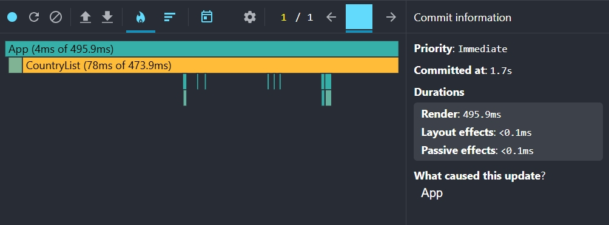
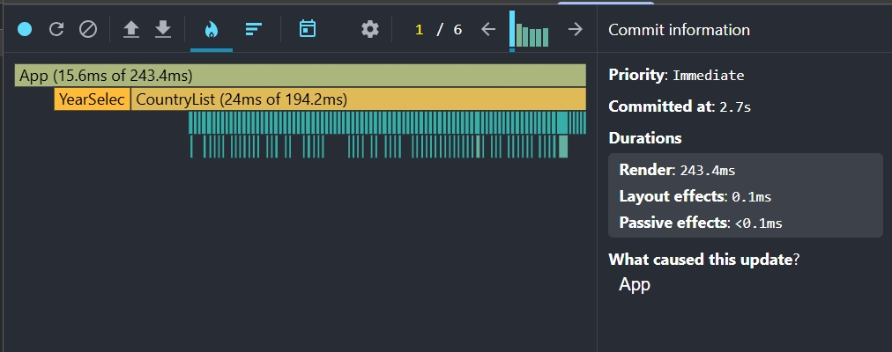
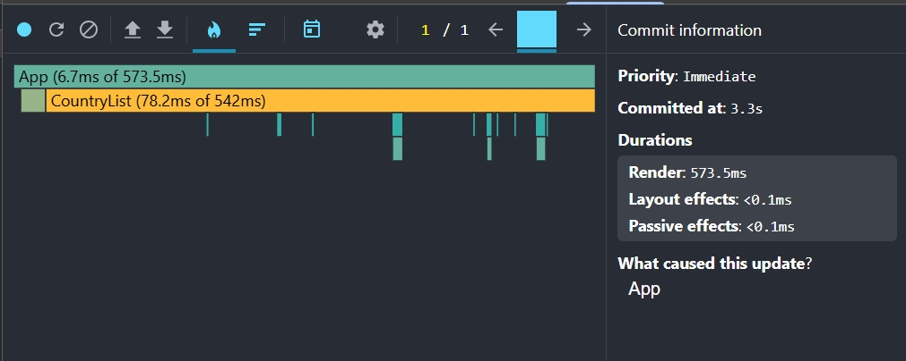
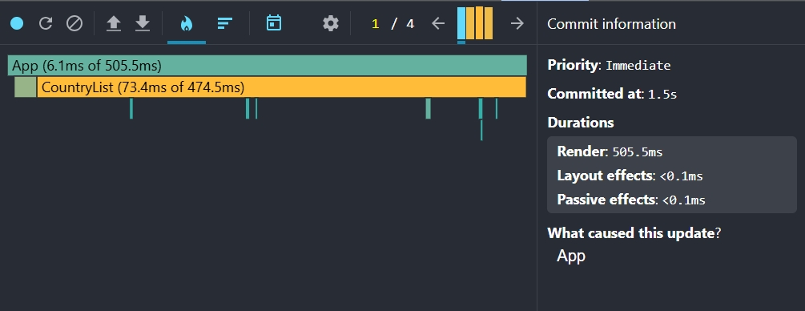
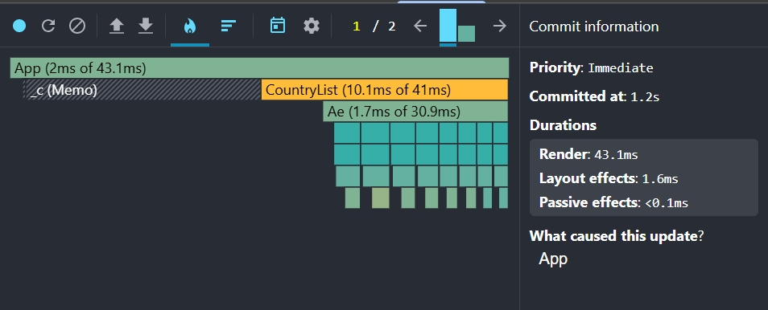
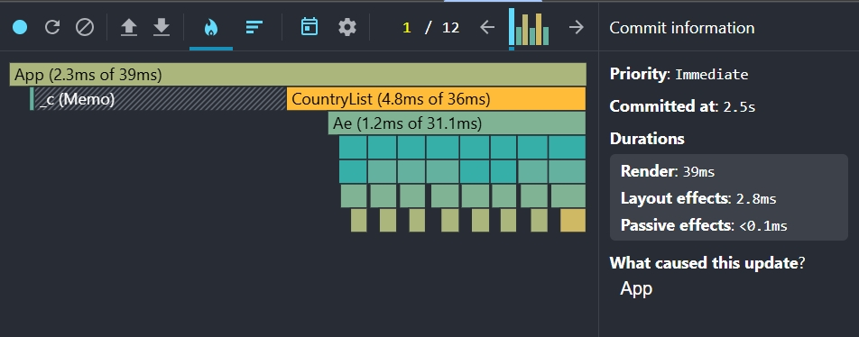
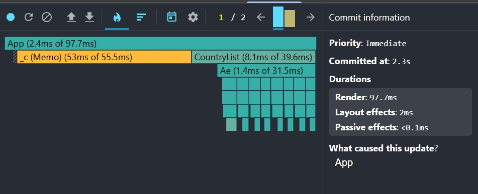
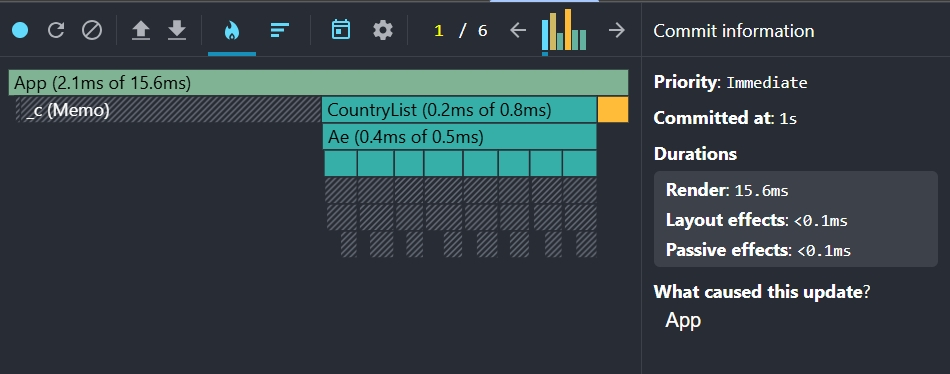

# Performance Optimization Report

## Baseline Measurements

### Interaction A: Sort countries

- **Commit duration**: 1.7 s
- **Render duration**: 495.9 ms
- **Screenshot**: 

### Interaction B: Search countries

- **Commit duration**: 2.7 s
- **Render duration**: 243.4 ms
- **Screenshot**: 

### Interaction C: Change year

- **Commit duration**: 3.3 s
- **Render duration**: 573.5 ms
- **Screenshot**: 

### Interaction D: Toggle column

- **Commit duration**: 1.5 s
- **Render duration**: 505.5 ms
- **Screenshot**: 

---

# Identified Performance Issues

- Large list rendering without virtualization
- Unnecessary re-renders in CountryList and CountryCard
- Expensive computations executed on every render
- Missing memoization of derived data
- Inefficient list mapping and sorting operations

---

# Phase 2: Optimizations Applied

## 1. Memoization

- useMemo used for:
  - filteredCountries
  - years list
  - available columns
  - expensive data transformations

- useCallback used for:
  - search handler
  - toggle handlers
  - modal handlers

---

## 2. Component Optimization

- React.memo applied to:
  - CountryCard
  - DataTable
  - ColumnModal
  - SearchBar
  - YearSelector

---

## 3. Virtualization

- Implemented react-window List in CountryList
- Only visible rows are rendered
- Reduced DOM nodes significantly

---

## 4. Key Fixes

- Fixed unstable keys in lists
- Removed unnecessary re-renders caused by inline functions
- Reduced recalculation of yearly maps

---

# Phase 3: Final Profiling (After Optimization)

### Interaction A: Sort countries

- **Commit duration**: 1.2 s
- **Render duration**: 43.1 ms
- **Screenshot**: 

### Interaction B: Search countries

- **Commit duration**: 2.5 s
- **Render duration**: 39 ms
- **Screenshot**: 

### Interaction C: Change year

- **Commit duration**: 2.3 s
- **Render duration**: 97.7 ms
- **Screenshot**: 

### Interaction D: Toggle column

- **Commit duration**: 1 s
- **Render duration**: 15.6 ms
- **Screenshot**: 

---

# 📈 Results Summary

| Interaction    | Commit Before | Commit After | Commit improvement |
|----------------|---------------|--------------|--------------------|
| Sorting        |      1.7 s    |     1.2 s    |        29.4%       |
| Search         |      2.7 s    |     2.5 s    |        7.4%        |
| Change year    |      3.3 s    |     2.3 s    |        30.3%       |
| Toggle columns |      1.5 s    |     1 s      |        33.3%       |

| Interaction    | Render Before | Render After | Render improvement |
|----------------|---------------|--------------|--------------------|
| Sorting        |    495.9 ms   |    43.1 ms   |        91.3%       |
| Search         |    243.4 ms   |    39 ms     |        84.0%       |
| Change year    |    573.5 ms   |    97.7 ms   |        83.0%       |
| Toggle columns |    505.5 ms   |    15.6 ms   |        96.9%       |

---

# 🧠 Conclusion

The application performance was significantly improved by:

- reducing unnecessary re-renders
- memoizing expensive computations
- implementing list virtualization
- stabilizing component props

As a result:
- UI is more responsive
- commit times are reduced
- rendering overhead is significantly lower